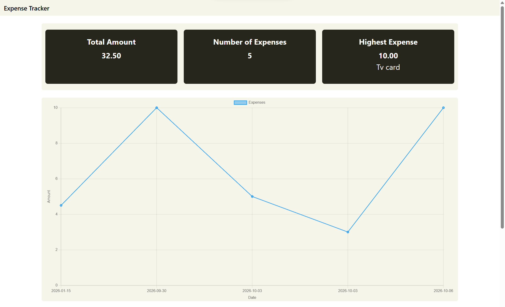
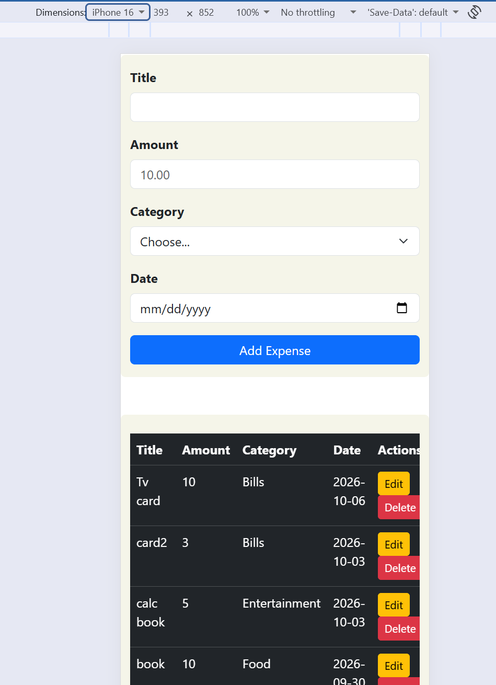

# Expense Tracker

expense tracker that help Users to trck ther payments 
by savein them with metadata like title , amount, category and date of exxpense.

## How to run
make sure you have the folowing installed :
postgresql  , node.js, VS code 

**Backend**

1.Download the project on you pc 
2.open the project on your VS code 
3.open terminal and navigate to backend folder using 'cd backend'
4.creat postgreSql database for the project and run Schema.sql 
5.creat new .evn file at your backend folder and add your postgreSQL connection information
based on Example.env
7.install depandancies using 'npm install'
8.start the backend server using 'node server.js'

**Frontend**
1.open frontend folder 
2.open index.html file

## Features

<!-- List what your app can do. Tick what you finished. -->

- [x] Add an expense (with validation)
- [x] Delete an expense
- [x] Edit an expense
- [x] Filter by category
- [x] Summary cards (total, count, highest)
- [x] Data is saved in a PostgreSQL database
- [x] Data can be downloaded as csv file 
- [x] linechart of your expenses to track them
## Screenshots

  Desktop :

  Mobile :

  

